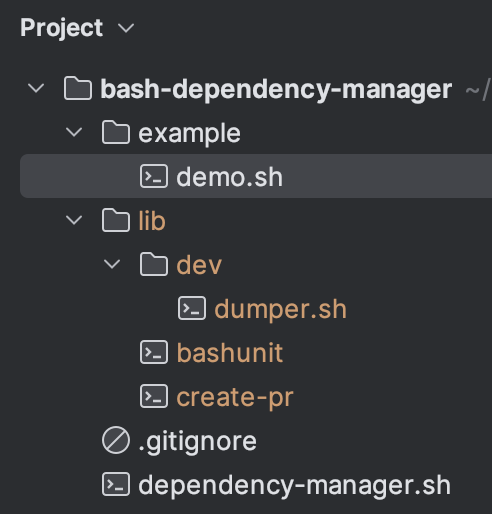

# bashdep

A minimalistic and straightforward **bash dependency manager**.

---
See the [demo](example/demo.sh).

```bash
DEPENDENCIES=(
  "https://github.com/TypedDevs/bashunit/releases/download/0.17.0/bashunit"
  "https://github.com/Chemaclass/create-pr/releases/download/0.6/create-pr"
  "https://github.com/Chemaclass/bash-dumper/releases/download/0.1/dumper.sh:lib/dev"
)

process_dependencies "${DEPENDENCIES[@]}"
```
### Demo result

